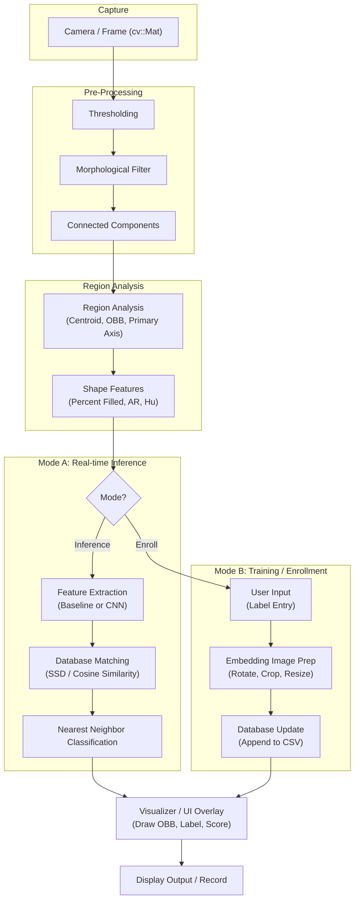

# Real-time 2D Object Recognition

A comprehensive system for real-time 2D object recognition using traditional computer vision techniques and modern deep learning (CNN) embeddings. This project supports multi-region detection, oriented bounding boxes, and interactive enrollment of new objects.

## Authors
- **Claire Liu**
- **Yu-Jing Wei**

## Project Structure

- **`src/`**: Source code files.
    - **`online/`**: Real-time application (`RTObjectRecognitionApp`).
    - **`offline/`**: Training and pre-processing utilities (`preTrainer`).
    - **`utils/`**: Shared helpers for CSV handling, feature extraction, and filters.
- **`include/`**: Header files for all modules.
- **`bin/`**: Compiled executables (`rtor`, `pretrain`).
- **`data/`**: Storage for feature databases (`.csv`) and enrolled object images.
- **`results/`**: Output directory for screenshots, debug frames, and recordings.
- **`obj/`**: Intermediate build artifacts.

---

## Installation & Build

### Prerequisites
- **OpenCV 4.x**
- **ONNX Runtime** (Optional, for CNN features)
- **C++17** compatible compiler
- **macOS Requirement**: Minimum version 26.2 (configured in Makefile)

### Compilation
Build all targets using the provided Makefile:
```bash
make all
```
Targets include:
- `rtor`: The main real-time recognition application.
- `pretrain`: Offline tool for batch feature extraction.

---

## Usage

### 1. Real-time Application (`rtor`)
Run the app to start recognition via your webcam:
```bash
./bin/rtor
```

#### **Interactive Controls**
| Key | Action |
| --- | --- |
| `q` | Quit Application |
| `t` | **Enroll New Object**: Enter a label, press `Enter` to save or `Esc` to cancel. |
| `b` | Toggle **Baseline** Matching (Shape-based) |
| `c` | Toggle **CNN** Matching (Deep Learning) |
| `d` | Toggle **Debug Overlay** (OBB & Primary Axis) |
| `s` | Capture **Screenshots** (Threshold, Cleaned, Region Map, OBB) |
| `r` | Toggle **Video Recording** |
| `u` | Toggle **Unknown Rejection** |
| `[` / `]`| Tighten / Loosen Unknown Match Thresholds |
| `1` | Show/Hide Thresholded Image Window |
| `2` | Show/Hide Morphologically Cleaned Window |
| `3` | Show/Hide Region Map Window |

### 2. Batch Processing (`pretrain`)
Extract features from a directory of images to populate your database:
```bash
./bin/pretrain -i <input_dir> -e <baseline|cnn> -o <output_csv> [-m <model.onnx>]
```

---

## Core Features

- **Pre-Processing**: Adaptive thresholding and morphological filtering to isolate objects.
- **Region Analysis**: Connected components analysis with centroid, primary axis, and oriented bounding box (OBB) calculation.
- **Feature Extraction**:
    - **Baseline**: 7-dimensional shape vector (Percent Filled, Aspect Ratio, Hu Moments).
    - **CNN**: 512-dimensional embedding using ResNet18 (requires ONNX).
- **Matching**: Scaled Euclidean (Baseline) and SSD/Cosine Similarity (CNN) for nearest-neighbor classification.
- **Live Tuning**: Real-time adjustment of rejection thresholds to handle "unknown" objects.

---

## System Architecture



---

## Dependencies
- **OpenCV**: Core, HighGUI, ImgProc, VideoIO, DNN.
- **ONNX Runtime**: Utilized for ResNet18 inference if enabled.

---

## File Descriptions

### Core Application
- **`main.cpp`**: Entry point for the real-time application.
- **`RTObjectRecognitionApp.cpp`**: Main application logic, handling the video loop, key events, and coordinating detection and matching.
- **`preTrainer.cpp`**: CLI tool for offline batch feature extraction and database generation.

### Feature Extraction
- **`IExtractor.hpp`**: Abstract interface for all feature extractors.
- **`extractor.cpp`**: Implementation of Baseline (shape) and CNN feature extraction.
- **`extractorFactory.cpp`**: Factory for creating specific extractor instances based on type.

### Processing & Analysis
- **`preProcessor.cpp`**: High-level detection pipeline (thresholding → cleaning → region analysis).
- **`regionAnalyzer.cpp`**: Computes spatial moments, centroid, oriented bounding box, and shape features for regions.
- **`thresholding.cpp`**: Implements various image thresholding techniques.
- **`morphologicalFilter.cpp`**: Provides erosion, dilation, and cleaning operations to refine binary masks.

### Matching & Data
- **`csvUtil.cpp`**: Utilities for reading/writing feature vectors to CSV files.
- **`featureMatcher.cpp`**: Core logic for matching a target vector against a database.
- **`distanceMetrics.cpp`**: Implementations of SSD, Euclidean, and Cosine distance metrics.
- **`metricFactory.cpp`**: Factory for distance metric instances.

### Utilities
- **`readFiles.cpp`**: Helpers for traversing directories and gathering image file paths.
- **`utilities.cpp`**: Shared image preparation tasks, such as cropping and resizing ROIs for CNN input.

---

## Acknowledgements
Special thanks to **Professor Bruce Maxwell** for the guidance and the foundational code structure provided for this project.
